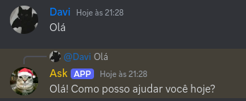

### Este projeto visa ajudar pessoas que desejam entender sobre conexões com APIs de outros serviços na sua aplipcação.

Neste projeto usamos a API do ChatGPT para que o bot do discord consiga enviar mensagens gerada pela IA do OpenAI e facilitar o uso dentro di Discord.

### Para usar este repositório, você deve ter as seguintes ferramentas intaladas:
- [Git](https://www.git-scm.com)
- [Node](https://www.nodejs.org)
- [VSCode](https://code.visualstudio.com)

Após a instalação do git, abra o terminal/cmd/poweshell e digite os seguintes comandos:
> git config --global user.name "seu_usuario_github"

> git config --global user.email "seu_endereco_emai"

Caso nada apareça no terminal, tudo ocorreu bem.

### Agora você deve baixar a versão deste código no seu computador

É possível baixar o código por arquivo .zip, chave SSH(Necessário autenticar as chaves do seu pc no github) ou chave HTTPS. No repositório do projeto, procure por um botão verde escrito "<> Code ⬇️" e selecione a forma de download, recomendo baixar via .zip ou HTTPS.

Após baixado, abra o projeto e faça a configuração dos arquivos privados.

### Configurando os arquivos necessários

Dentro do projeto, note que haverá uma pasta chamada src/, abra/extenda a mesma e crie uma nova pasta chamada configs(Tem que ser exatamente assim para não dar erro de importação), dentro de configs, você terá de cirar 3 arquivos:
- clientConfig.json
- openai.json
- serverConfig.json

Dentro de clientConfig.json, você deve inserir os dados da sua aplicação/bot do discord.

```
{
    "clientId": "id_da_aplicacao",
    "token": "token_da_aplicacao"
}
```

Dentro de openai.json, você deve inserir a chave da sua API, acessível em: [API](https://platform.openai.com/docs/quickstart)
```
{
    "token": "token_da_api"
}
```

Dentro de serverConfig.json, você deve inserir os dados do seu servidor do discord.
```
{
    "serverId": "id_do_servidor",
    "chatChannel": "id_do_canal_de_texto_que_o_bot_vai_enviar_mensagem"
}
```

### Instale as bibliotecas do npm
Por fim, rode o comando:
> npm i

Aguarde e, após instalado, rode o comando
> node index.js

Caso tenha o nodemon instalado, basta usar o comando
> nodemon

### Pronto, agora é só fazer as perguntas! Se gostou, deixe uma estrela

### ⚠️ Lembrando que o bot só responde no canal certo, que está sendo passado em forma de id no arquivo serverConfig.json

## Segue imagem mostrando como funciona a resposta do bot
<div align=center>
    
</div>

## Suporte
Vocẽ pode entrar em contato comigo através do meu Discord, que está disponibilizado no meu README(perfil do GitHub).